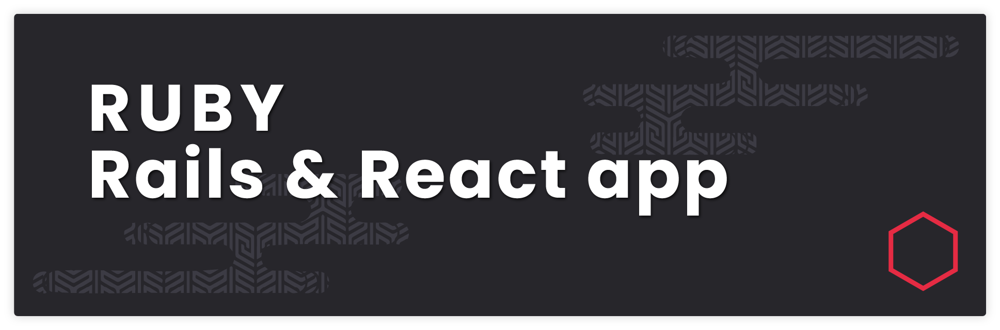
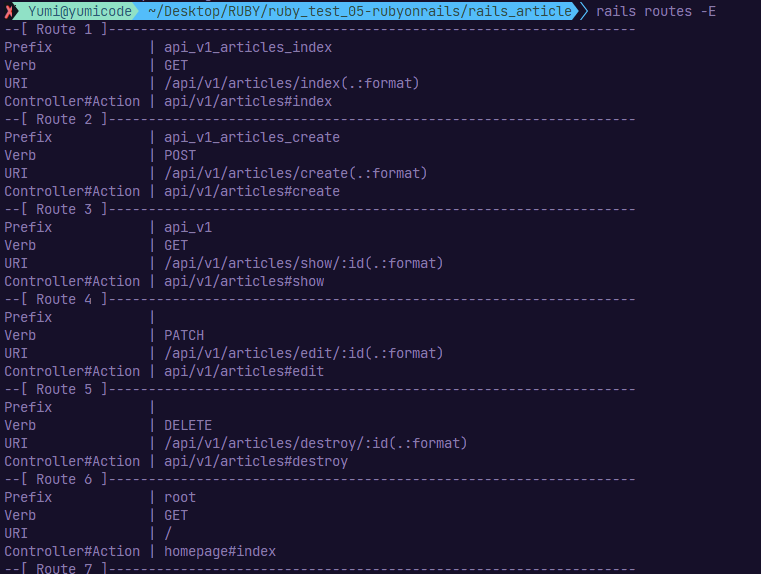
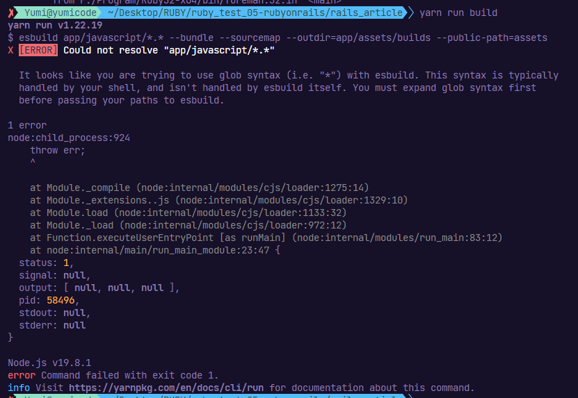
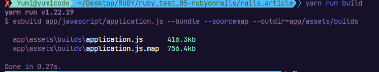

# Ruby on Rails and React



## Introduction

app is built using the Ruby on Rails framework on the backend and React on the frontend. The app allows users to perform CRUD (Create, Read, Update, Delete) operations on data stored in a PostgreSQL database.

Hope it can help :)

## Summary

- [Requirements](#requirements)
- [Tools and version](#tools-and-versions)
- [Folder structure](#folder-structure)
- [Makefile usage](#makefile-usage)
- [Project : Rails and React](#project)
- [Some tips](#tips)

- [Demo](#demo)

- [Sources](#sources)

## Requirements

- NodeJS and npm installed on local machine or development server
- Ruby installed with Gem and Rails

Install Rails with gem:

```sh
#check if exist
gem --version

gem install rails
```

Assuming you have installed Rails using RubyGems, keeping it up-to-date is relatively easy. We can use the same command in both Windows and Linux platform.

```sh
gem update rails
```

## Tools and versions

- OS

  - Kali Linux OS - Ruby v3.1.2
  - Windows OS - Ruby v3.2.2

- IDE

  - VSCodium v1.77.1

- Backend

  - Gem v3.4.10
  - Rails v7.0.4.3

- Frontend
  - React v18.2.0
  - Bootstrap v5.2.3

## Folder structure

```sh

```

## Makefile Usage

```sh
#run rails server
run_rails:
	rails server

#build react app
build:
	yarn build

#build react app watch for changes
build_watch:
	yarn build --watch
```

## Project

### Rails and React

- Create the database

- Install front end dependencies

- Setting up Homepage

- Create controller

```sh
rails generate controller api/v1/articles index create show destroy  --skip-template-engine --no-helper
```

- Routes



## Tips

- Errors you may have with esbuild:



To resolve this error, add in package.json

```json
  "scripts": {
    "build": "esbuild app/javascript/application.js --bundle --sourcemap --outdir=app/assets/builds"
    ...
  }
```

And relaunch:

```sh
yarn run build
```




---

## Sources

- [Resolve esbuild](https://discuss.rubyonrails.org/t/brand-new-rails-7-0-app-the-asset-application-js-is-not-present-in-the-asset-pipeline/79548/9)
- [Edit action](https://human-se.github.io/rails-demos-n-deets-2021/demos/edit-update-forms/)
